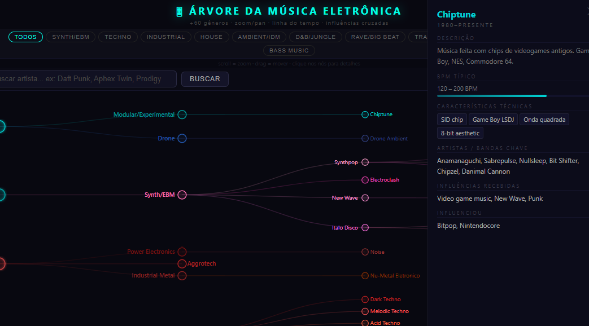

# 🎛 Árvore da Música Eletrônica

Mapa interativo de gêneros e subgêneros da música eletrônica, com artistas, características técnicas, BPM e influências cruzadas entre estilos.

**[→ Ver online](https://valdirsjr.github.io/EDMtree)**



---

## O que é

Um arquivo HTML único, sem dependências externas além do D3.js (carregado via CDN), que renderiza uma árvore navegável com:

- **79 gêneros e subgêneros** mapeados — de Musique Concrète (1948) ao Future Bass (2013)
- **22 conexões de influência cruzada** entre gêneros que não seguem a hierarquia da árvore
- **Busca por artista** com destaque visual dos estilos em que ele aparece
- **Painel de detalhes** com BPM, características técnicas, artistas chave, influências recebidas e exercidas
- **Zoom + pan** com scroll do mouse e drag
- **Filtros por família** (Techno, House, Ambient/IDM, D&B, Trance, etc.)

---

## Famílias de gêneros cobertas

| Família | Exemplos de gêneros |
|---|---|
| Synth / EBM | Synth/EBM, Synthpop, New Wave, Darkwave, Italo Disco, Electroclash |
| Techno | Techno, Dark Techno, Melodic Techno, Minimal Techno, Acid Techno, Dub Techno, Gabber, Hardstyle |
| Industrial | Industrial, Power Electronics, Noise, Aggrotech, Industrial Metal |
| House | House, Deep House, Afro House, Tech House, Acid House, French House, UK Garage, Progressive House |
| Ambient / IDM | Ambient, IDM, Glitch, Dark Ambient, Drone, Trip-Hop, Chillout, Downtempo |
| D&B / Jungle | Jungle, Drum & Bass, Neurofunk, Liquid DnB, Jump Up, Halftime |
| Trance | Trance, Uplifting Trance, Goa Trance, Psytrance, Dark Psy, Psybient |
| Rave / Big Beat | Hardcore Rave, Rave/Big Beat, Happy Hardcore, Breakbeat |
| Bass Music | Dubstep, Brostep, Grime, Future Bass, Trap Eletrônico |
| Electropop / Dance | Eurodance, Electropop, Nu-Disco, EDM, Indie Dance |
| Experimental | Musique Concrète, Krautrock, Modular/Experimental, Chiptune, Vaporwave, Lo-fi Hip-hop, Footwork/Juke |

---

## Como usar

### Localmente

Basta abrir o arquivo no navegador — não precisa de servidor:

```bash
git clone https://github.com/seu-usuario/electronic-music-tree
cd electronic-music-tree
open electronic_music_tree.html   # macOS
# ou
xdg-open electronic_music_tree.html  # Linux
# ou arraste o arquivo para o Chrome/Firefox
```

### GitHub Pages

1. Faça o fork ou clone do repositório
2. Vá em **Settings → Pages**
3. Em *Source*, selecione `main` branch e pasta `/ (root)`
4. Aguarde alguns minutos e acesse `https://seu-usuario.github.io/electronic-music-tree`

---

## Controles

| Ação | Como fazer |
|---|---|
| Zoom in/out | Scroll do mouse / botões + − |
| Mover o mapa | Clique e arraste |
| Ver detalhes de um gênero | Clique no nó |
| Buscar artista | Campo de busca no topo |
| Filtrar por família | Botões de filtro (Techno, House, etc.) |
| Ver influências cruzadas | Botão ⚡ Influências Cruzadas |
| Resetar a view | Botão Reset View |

### Busca por artista

Digite o nome (parcial funciona) para destacar na árvore todos os gêneros em que o artista aparece. Exemplos:

- `Daft Punk` → French House, Progressive House
- `Aphex Twin` → Ambient, IDM
- `Charlotte de Witte` → Dark Techno, Melodic Techno
- `Nora En Pure` → Deep House, Melodic House/Techno, Organic House
- `The Prodigy` → Rave/Big Beat, Hardcore Rave

---

## Tecnologias

- **HTML/CSS/JS** puro — arquivo único, sem build step
- **[D3.js v7](https://d3js.org/)** — layout de árvore, zoom/pan, renderização SVG

---

## Estrutura do arquivo

```
electronic_music_tree.html
│
├── <style>          CSS inline (dark theme, painel lateral, busca)
│
└── <script>
    ├── G{}          Objeto com todos os 79 gêneros
    │                (família, cor, era, descrição, BPM, técnicas, artistas, influências)
    ├── CROSS[]      22 conexões de influência cruzada
    ├── treeData{}   Estrutura hierárquica da árvore
    ├── buildTree()  Renderização D3 com zoom/pan
    ├── drawCross()  Setas de influência cruzada com gradiente
    └── searchArtist() Busca e highlight por artista
```

---

## Contribuindo

Faltou algum gênero ou artista? Pull requests são bem-vindos.

Para adicionar um gênero, edite o objeto `G` no script:

```javascript
"Nome do Gênero": {
  f: "familia",       // synth | techno | industrial | house | ambient | dnb | rave | trance | pop | experimental | bass
  c: "#hexcolor",     // cor do nó
  e: "1990–presente", // era
  yr: 1990,           // ano de surgimento (para ordenação)
  d: "Descrição...",  // texto do painel
  b: [120, 135],      // [BPM mínimo, BPM máximo]
  ch: ["Característica 1", "Característica 2"],
  a: "Artista 1, Artista 2, Artista 3",
  i: "Influências recebidas",
  o: "O que influenciou"
}
```

Depois adicione o nó na estrutura `treeData` no lugar hierárquico correto.

---

## Licença

MIT — use, modifique e compartilhe à vontade.
